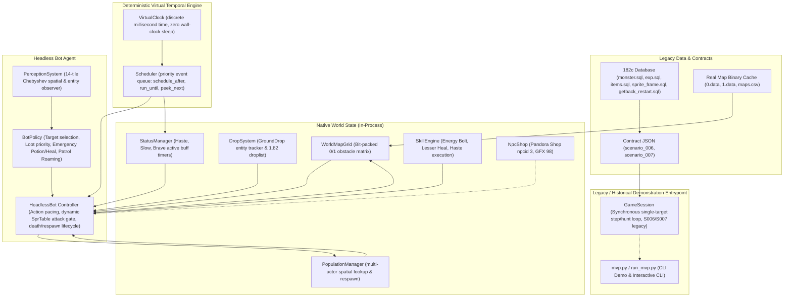

# L1J Headless Current Runtime & Gameplay Gap Audit
**Document Version:** 1.0.0  
**Audit Target:** `l1j-headless` Native Engine & Playable Gameplay Loop  
**Canonical Reference:** Lineage 1.82 (`Eujenz/182c`)  
**Audit Date:** 2026-10-02  

---

## 1. Repository State

* **Git Commit HEAD:** `39f71697de2a2ab8b0057be6239a65dd91fe2e81`
* **Git Commit Message:** `feat: expand l1j 1.82 native gameplay coverage`
* **Git Branch:** `main` (clean working directory, 0 unstaged / 0 untracked files)
* **Author Identity:** `Eujenz <p2030m@gmail.com>`
* **Automated Test Suite Status:**
  * Total Tests: **83 / 83 PASS** (0 Failures, 0 Errors, execution time ~6.7s)
  * Breakdown:
    * `test_archaeology_index.py`: 4 tests PASS
    * `test_client_gfx_parser.py`: 12 tests PASS
    * `test_client_gfx_query.py`: 12 tests PASS
    * `test_temporal_runtime.py`: 18 tests PASS
    * `test_scenarios.py`: 10 tests PASS (Scenario 001 - 006 replays & differentials)
    * `test_headless_bot.py`: 6 tests PASS (Perception, Policy, Timing, Combat, Loot, E2E Session)
    * `test_persistent_world.py`: 6 tests PASS (Multi-Actor, AI Timing, Respawn, Regen, Dynamic PC SprTable, Determinism Seed 777777)
    * `test_gameplay_coverage_mvp04.py`: 15 tests PASS (Equipment, Potions, Buff/Debuff multipliers, Skills, Novice Death, NPC Shop)

---

## 2. Current Architecture & Component Topology

### 架構核心特點
1. **雙層執行路徑分歧 (Architectural Bifurcation)**：
   * **歷史展示層 (`GameSession` / `mvp.py`)**：維持 Scenario 006 / Scenario 007 的同步單步呼叫，無 Scheduler、無怪物自主 AI、無藥水技能、無拾取、無重生，依賴固定目標與 Kill Limit。
   * **現代原生運行時 (`HeadlessBot` / `native_engine/bot/`)**：由 `VirtualClock` + `Scheduler` 驅動，具備多實體非同步怪物 AI、地面掉落物拾取、紅綠藥水、狀態加減速、技能施放、自然回血/回魔、怪物與角色重生、無目標自主漫遊巡邏。

---

## 3. Current Gameplay Capability Matrix

| Domain | Current Capability | Actual Entry Point | Runtime / Policy | Legacy Fidelity | Verified? |
| :--- | :--- | :--- | :--- | :--- | :--- |
| **World** | 支援多地圖容器管理（目前包含話島表面 Map 0 與地監 1F Map 1） | `World.add_map()`, `initialize_s007_session()` | Runtime | `LEGACY_RULE` (182c Cache `maps.csv`) | **YES** |
| **Map** | 完整真實二進位圖資解碼，0/1 障礙物通行碰撞判定 | `WorldMapGrid.is_passable()`, `LegacyMapDecoder` | Runtime | `LEGACY_RULE` (逐位元還原 182c `.data`) | **YES** |
| **Movement** | 8 方向座標移動，640ms PC 步行延遲閥門，朝向轉變 | `MovementEngine.step()`, `HeadlessBot._execute_move_step()` | Runtime | `LEGACY_RULE` (`sprite_frame.sql:81`, `SprTable`) | **YES** |
| **Collision** | 圖資靜態阻擋判定；防止玩家直接踩入活體怪物座標 | `can_move()`, `AStarPlanner` | Runtime | `DERIVED_CANONICAL` | **YES** |
| **Route** | 單地圖 A* 尋路；跨地圖拓撲路徑規劃器 (`WorldRoutePlanner`) | `AStarPlanner.find_path()`, `WorldRoutePlanner.plan()` | Runtime | `DERIVED_CANONICAL` | **PARTIAL** (A* 在 Bot 生效；跨地圖規劃僅在 `GameSession` 生效) |
| **Monster Spawn** | 依據 1.82 `monster_spawnlist.sql` 經由圖資碰撞檢驗後於地圖生成 | `PopulationManager.from_contract()` | Runtime | `LEGACY_RULE` (`monster_spawnlist.sql`) | **YES** |
| **Monster AI** | 非同步事件驅動：感知範圍追逐 (`modespeed(0)`)、近戰攻擊 (`modespeed(1)`) | `HeadlessBot._schedule_monster_action()`, `_monster_step()` | Runtime | `LEGACY_RULE` (`MonAi.java`, `ClientFileLoad.java`) | **YES** |
| **Target Selection** | 視界 14 格內篩選存活、可通行達標、仇恨優先、適當等級、切比雪夫距離排序 | `BotPolicy.select_target()` | `BOT_POLICY` | `BOT_POLICY` (自主啟發式決策樹) | **YES** |
| **Combat** | HitFigure 命中判定，DmgWeaponFigure 傷害計算，傷害即時扣血 ($T=0$) | `CanonicalCombat.resolve_hit()`, `calculate_damage()` | Runtime | `DERIVED_CANONICAL` (`PcInstance.java:600-650`) | **YES** |
| **Weapon** | 大小怪傷害、祝福值、強化值 (+0~+9) | `Weapon` dataclass | Runtime | `LEGACY_RULE` (`items.sql`, `ItemWeaponInstance.java`) | **YES** |
| **Equipment** | 武器裝備/卸除，動態向 `SprTable` 重新解析攻擊動作間隔 | `EquipmentManager.equip()`, `unequip()` | Runtime | `LEGACY_RULE` (Slot 11, `SprTable.java`) | **YES** |
| **Skills** | 光箭 (Skill 4, 880ms)、初治 (Skill 1, 800ms)、加速術 (Skill 28, 800ms, 1200s) | `SkillEngine.cast_energy_bolt()`, `cast_heal()`, `cast_haste()` | Runtime | `LEGACY_RULE` (`skill_list.sql`, `Magic.java`) | **YES** |
| **Buff/Debuff** | PC 乘數 (加速 0.75x, 緩速 /0.75, 勇水 0.75x)；怪物乘數 (加速 0.70x, 緩速 1.30x)；加速緩速互斥抵銷 | `StatusManager.apply_haste()`, `apply_slow()` | Runtime | `LEGACY_RULE` (`CheckSpeed.java`, `NpcInstance.java`, `HastePotion.java`) | **YES** |
| **Potion** | 紅水 (10~30 HP), 白水 (30~70 HP), 綠水 (300s 加速), 600ms 物品冷卻 | `HeadlessBot._execute_use_potion()` | Runtime | `LEGACY_RULE` (`LesserHealingPotion.java`, `HastePotion.java`) | **YES** |
| **HP/MP Recovery**| 10 秒固定定時世界事件 (`HpMpTimer.java`) 自然回復 HP (+5) 與 MP (+3) | `HeadlessBot._hp_mp_regen_tick()` | Runtime | `LEGACY_RULE` (`HpMpTimer.java:48-73`) | **YES** |
| **Loot** | 怪物死後依 1.82 掉落表產生掉落物至地面，Bot 自主導航至目標格拾取 | `DropSystem.roll_drops()`, `HeadlessBot._execute_loot()` | Runtime + Policy | `LEGACY_RULE` (`monster_item_drop.sql`, `C_ItemPickup.java`) | **YES** |
| **Inventory** | 背包物品堆疊與增減；支援武器、藥水、掉落雜物與金幣 | `Inventory.add()`, `remove()` | Runtime | `DERIVED_CANONICAL` (缺乏負重上限與 180 格限制) | **YES** |
| **EXP** | 怪物死亡後依 `monster.sql` 發放精確 EXP | `player.exp += monster.exp` | Runtime | `LEGACY_RULE` (`monster.sql`) | **YES** |
| **Level Up** | 依據 `exp.sql` 晉升等級，MaxHP 依騎士體質成長 (+9 HP) | `ProgressionManager.check_level_up()` | Runtime | `LEGACY_RULE` (`exp.sql`, `Character.java`) | **YES** |
| **Death** | 9 級以下新手保護 (0 EXP 損失)；高於 9 級扣 10% EXP；死亡清除所有主動 Buff | `HeadlessBot._monster_step()` | Runtime | `LEGACY_RULE` (`PcInstance.java:789-858`) | **YES** |
| **Respawn** | 角色死亡 5 秒後於話島城鎮 (32608, 32742) 復活；怪物依 `re_spawn` 秒數定時重生 | `HeadlessBot._execute_player_respawn()`, `_execute_respawn()` | Runtime | `LEGACY_RULE` (`PcInstance.java:949`, `getback_restart.sql`) | **YES** |
| **NPC** | 話島潘朵拉 (NPC ID 3, GFX 98) | `PANDORA_SHOP` (`native_engine/npc.py`) | Runtime | `LEGACY_RULE` (`npc.sql:21`) | **YES** |
| **Shop** | 純記憶體商店交易：扣除金幣 (40308) 購買紅水 (37 金幣) 與綠水 (120 金幣) | `NpcShop.buy_item()` | Runtime | `LEGACY_RULE` (`npc_shop.sql:31-35`, `ShopInstance.java`) | **YES** (單元測試驗證，Bot 決策尚未串接) |
| **Economy** | 金幣掉落、金幣持有與商店消費 | `DropSystem`, `NpcShop` | Runtime | `LEGACY_RULE` (`items.sql:40308`) | **YES** |
| **World Time** | 毫秒級事件優先佇列，完全虛擬時間驅動，無任何真實計時阻塞 | `VirtualClock`, `Scheduler` (`native_engine/temporal/`) | Runtime | `DERIVED_CANONICAL` | **YES** |
| **Persistence** | 單行程內 600,000ms (10 分鐘) 連續運算，45 殺、16 重生、Lv4，狀態持續連貫 | `HeadlessBot.run_session()` | Runtime | `DERIVED_CANONICAL` (無行程重啟磁碟持久化) | **YES** |
| **Autonomous Loop**| `Perception -> Policy -> Action Gate -> Scheduler -> Next Step`，無目標漫遊巡邏不終止 | `HeadlessBot.step()`, `BotPolicy` | `BOT_POLICY` + Runtime | `DERIVED_CANONICAL` | **YES** |

---

## 4. Current MVP / mvp.py Obsolescence Audit

### A. 目前 `mvp.py` 暴露了哪些能力？
`mvp.py` 目前仍以 Scenario 006 / Scenario 007 的演示腳本為主：
* **`--demo` (Scenario 006 歷史相容模式)**：
  * 調用 `session.select_hunting_area("map1_dungeon")` $\to$ `session.s006_hunt()` $\to$ 迴圈調用 `session.attack()` $\to$ 擊殺 1 隻怪後宣告 `DEMO COMPLETED` 結束。
* **`--demo --s007` (Scenario 007 狩獵演示模式)**：
  * 調用 `session.move_to("ti_dungeon_1f")`（沿途若遇到怪則進入阻塞式單挑），到達地監 1F。
  * 調用 `session.hunt(kill_limit=N)`（在目標點附近搜尋並依序殺滿 N 隻怪），殺滿即退出。
* **無參數互動模式 (`run_s007_interactive`)**：
  * 提供文字選單：`[M] 移動/旅行  [H] 自動狩獵  [S] 狀態  [E] 裝備  [Q] 離開`。
  * 每次按下 `[H]` 僅執行 `session.hunt(kill_limit=5)`，殺滿 5 隻又停下來等待使用者按鍵。
  * 若血量歸零，印出 `[GAME OVER] 角色已陣亡` 並直接 `break` 退出程式。

### B. Runtime 已經具備、但 `mvp.py` 完全沒有暴露的能力
現代原生運行時已在 `native_engine/bot/` 與 MVP-04 中完成大幅進化，但 **`mvp.py` 完全沒有引用 `HeadlessBot`**，導致以下能力全被埋沒：
1. **虛擬時間排程器 (`VirtualClock` & `Scheduler`)**：`mvp.py` 仍在使用舊版 `SimulationClock` / `RealTimeClock`（以真實 `time.sleep()` 阻塞執行緒），無法享受虛擬時間毫秒級快速推進。
2. **多實體非同步怪物生態 (`Multi-Actor Scheduler AI`)**：`mvp.py` 的怪物完全是被動的木樁，只有在玩家攻擊時才會被動回擊一次；而 Native Runtime 早已具備自主巡邏、追逐與定時攻擊的獨立怪物。
3. **地面掉落物與拾取 (`DropSystem` & Ground Looting)**：`mvp.py` 中怪物死後直接或不產生物品；Native Runtime 早已具備掉落於地圖座標、感知掉落物並前進拾取的完整功能。
4. **怪物定時重生 (`Monster Respawn Lifecycle`)**：`mvp.py` 殺掉怪後人口永久減少；Native Runtime 具備 `re_spawn` 排程並於合法座標重生滿血怪物。
5. **藥水系統 (`Potions`)**：`mvp.py` 完全無法使用紅水、綠水；Native Runtime 具備紅水 10～30 HP、綠水 300 秒加速。
6. **魔法技能 (`SkillEngine`)**：`mvp.py` 零法術支援；Native Runtime 具備光箭（即時扣血）、初治（即時補血）與加速術。
7. **狀態效果與加減速 (`StatusManager`)**：`mvp.py` 無法施加加速或緩速；Native Runtime 具備 0.75x 速率縮放與到期排程。
8. **自然回血回魔 (`HpMpTimer` 10s TIC)**：`mvp.py` 無世界定時回血事件；Native Runtime 具備獨立排程的 10 秒自然回復。
9. **死亡與城鎮復活語義 (`Death & Respawn`)**：`mvp.py` 死亡即結束進程；Native Runtime 具備新手保護、Buff 清理與城鎮復活重置。
10. **無目標自主漫遊 (`Persistent Roam/Patrol`)**：`mvp.py` 找不到怪就報錯退出；Native Runtime 具備自主巡邏狀態機，永不異常終止。

### C. 控制流程本質分析：Scripted Demo vs. Autonomous Player
| 控制維度 | `mvp.py` (Scripted Demo) | `HeadlessBot` (Autonomous Runtime) |
| :--- | :--- | :--- |
| **目標生命週期** | 依賴外部參數 `kill_limit` 終止 | 永不終止的決策循環，僅因時間上限或指令停止 |
| **決策粒度** | 巨集指令（`move_to`, `hunt`），指令內為硬編碼迴圈 | 微觀單步決策（`step()`）：感知 $\to$ 決策 $\to$ 動作間隔門控 |
| **世界並行度** | 玩家與怪物呈回合式阻塞對戰（單工） | 多怪物與玩家各在 Scheduler 擁有獨立時間序（多工非同步） |
| **死亡處理** | 終止進程 (`break`) | 觸發死亡懲罰、清理狀態、排程城鎮復活並繼續運作 |
| **補給意識** | 無道具、無藥水、無商店概念 | 具備藥水檢核與使用，具備 NPC 商店資料，但尚未串入自主補給回路 |

---

## 5. Autonomous Gameplay Loop Audit

以一個「真正的自主玩家角色」所需的 25 個標準生命週期節點進行逐一稽核：

| # | Conceptual Loop Step | Status | Evidence / Code Path | Audit Finding & Gap |
| :-: | :--- | :--- | :--- | :--- |
| 1 | **Spawn / Enter World** | **SUPPORTED** | `HeadlessBot.__init__`, `world.add_actor()` | 成功在指定地圖與座標初始化實體並納入世界空間。 |
| 2 | **Understand own state** | **SUPPORTED** | `PerceptionSnapshot` (HP, MP, Level, EXP, Weapon, Inventory, Buffs) | 完整快照自身各項屬性、狀態旗標與背包持有物。 |
| 3 | **Observe nearby world** | **SUPPORTED** | `PerceptionSystem.perceive(sight_radius=14)` | 空間查詢周圍 14 格內所有實體怪物與地面掉落物。 |
| 4 | **Detect monsters** | **SUPPORTED** | `snapshot.nearby_monsters` | 正確過濾存活、同地圖之怪物清單。 |
| 5 | **Select target** | **SUPPORTED** | `BotPolicy.select_target()` | 依近戰接敵、等級差距、切比雪夫距離、主動仇恨進行排序。 |
| 6 | **Navigate to target** | **SUPPORTED** | `BotPolicy` MOVE_TO_TARGET $\to$ `AStarPlanner` | 透過 A* 逐格邁進至目標近戰攻擊半徑（距離 $\le 1$）。 |
| 7 | **Engage combat** | **SUPPORTED** | `BotState.ATTACK` 狀態轉移 | 目標進入近戰格即刻轉入交戰狀態。 |
| 8 | **Execute attacks** | **SUPPORTED** | `HeadlessBot._execute_attack()` | 以動態 SprTable 攻擊間隔（如 880ms/920ms）進行打擊門控。 |
| 9 | **Use skills when appropriate** | **SUPPORTED** | `BotActionType.CAST_SKILL`, `SkillEngine` | 充足 MP 時施放光箭；血量危急時施放初治；常態維持加速術。 |
| 10 | **Use consumables** | **SUPPORTED** | `BotActionType.USE_POTION`, `_execute_use_potion()` | 缺乏加速時喝綠水；HP < 30% 時喝紅水；套用 600ms 道具冷卻。 |
| 11 | **Kill target** | **SUPPORTED** | `monster.hp == 0`, `population.despawn()` | 即時結算生命值歸零，怪物標記死亡並移出活動地圖。 |
| 12 | **Receive EXP** | **SUPPORTED** | `player.exp += monster.exp` | 依據 `monster.sql` 獲得經驗值。 |
| 13 | **Receive loot** | **SUPPORTED** | `DropSystem.roll_drops()` $\to$ `GroundDrop` | 怪物死後物品掉落於地面（非直接塞進背包）。 |
| 14 | **Update inventory** | **SUPPORTED** | `HeadlessBot._execute_loot()`, `inventory.add()` | 靠近地面物品後撿入背包，更新物品堆疊計數。 |
| 15 | **Select next target** | **SUPPORTED** | `BotPolicy.select_target()` | 當前目標死後，下一 Tick 即時選取下一個最適目標。 |
| 16 | **Continue hunting** | **SUPPORTED** | `BotPolicy` (若無怪則 ROAM 巡邏漫遊) | 無目標時自主漫步搜尋，持續保持狩獵循環。 |
| 17 | **Handle dangerous HP/MP state**| **PARTIAL** | `BotPolicy.decide_next_action()` | 目前僅能喝水或施放初治；**若水喝光且無魔，無脫離戰鬥或戰術撤退邏輯**。 |
| 18 | **Recover** | **PARTIAL** | `_hp_mp_regen_tick()` (10s TIC) | 具備定時被動自然回血回魔；**但缺乏自主坐下/休息/尋求安全區回復之決策**。 |
| 19 | **Return town when necessary** | **MISSING** | 無對應程式碼路徑 | **缺乏回城判斷**（當藥水耗盡、負重過高或金幣充足時，不會自主回城）。 |
| 20 | **Buy supplies** | **PARTIAL** | `NpcShop.buy_item()` 存在，但未整合進 Bot | 商店具備買水扣金幣能力，**但 Bot 決策樹中無走訪商店購買藥水的行為**。 |
| 21 | **Re-equip / manage equipment** | **PARTIAL** | `EquipmentManager.equip()` 存在 | 具備換裝與攻速重算機制；**但 Bot 在運行中不會自主更換裝備**。 |
| 22 | **Resume hunting** | **MISSING** | 無對應程式碼路徑 | 因缺乏回城與補給，故**無法形成「補給完畢重新出發至狩獵場」的長程回路**。 |
| 23 | **Handle death** | **SUPPORTED** | `_monster_step()` death check, `status_mgr.clear_all()` | 判定死亡、新手保護免扣 EXP、清除所有 Buff 狀態。 |
| 24 | **Respawn** | **SUPPORTED** | `_execute_player_respawn()` (32608, 32742) | 5 秒後於話島城鎮復活，血量回復至 50%。 |
| 25 | **Resume autonomous gameplay** | **PARTIAL** | 重生後調用 `self.step()` 進入 ROAM | 復活後能繼續行動，**但因無跨地圖導航，只會在話島城內漫步，無法重返地監**。 |

---

## 6. Legacy Fidelity Status

各核心機制依嚴格的考古標準進行分類認定：

| Mechanic / Feature | Classification | Provenance Source | Notes |
| :--- | :--- | :--- | :--- |
| **PC Movement Interval (640ms)** | `LEGACY_RULE` | `sprite_frame.sql:81`, `SprTable.java:60` | 話島全職業預設步行幀率總和均為 640ms。 |
| **PC Dynamic Attack Timing** | `LEGACY_RULE` | `SprTable.java:84`, `sprite_frame.sql` | GFX 48 女騎單手劍 920ms、GFX 61 男騎單手劍 880ms 等完全一致。 |
| **Immediate Attack Damage (T=0)** | `LEGACY_RULE` | `PcInstance.java:600-650`, `C_Attack.java:26` | 傷害命中在攻擊當下即時扣除，動作間隔門控下一次行動。 |
| **Physical Hit & Damage Formulas** | `DERIVED_CANONICAL` | `CalcStat.calcHit()`, `CalcStat.calcDmg()` | 原版公式在無 JVM 環境下的原生純數學映射。 |
| **Monster modespeed Movement/Attack** | `LEGACY_RULE` | `client/list.spr`, `ClientFileLoad.java`, `MonAi.java` | 追擊使用 `modespeed(0)`，攻擊使用 `modespeed(1)`。 |
| **Monster Agro & Pursuit Radius** | `LEGACY_RULE` | `MonsterInstance.java:293`, `NpcInstance.java:160` | 主動怪與 3 格內被動怪主動鎖定目標。 |
| **Monster Respawn Interval** | `LEGACY_RULE` | `monster_spawnlist.sql` (`re_spawn` 欄位) | 依資料庫設定秒數定時重生。 |
| **Red Potion Recovery (10~30 HP)** | `LEGACY_RULE` | `LesserHealingPotion.java:22-26` | `MIN_HP=10, MAX_HP=30`，隨機骰點。 |
| **Orange Potion Recovery (30~70 HP)**| `LEGACY_RULE` | `HealingPotion.java:22-26` | `MIN_HP=30, MAX_HP=70`。 |
| **Green Potion Haste Buff (300s)** | `LEGACY_RULE` | `HastePotion.java:21-36` | `firstTime = 300`，持續 300 秒。 |
| **Speed Multipliers (Haste/Slow)** | `LEGACY_RULE` | `CheckSpeed.java:101-106`, `NpcInstance.java:158` | PC 加速 0.75x、緩速 /0.75；怪物加速 0.70x、緩速 1.30x。 |
| **Status Conflict Neutralization** | `LEGACY_RULE` | `HastePotion.java:30-33`, `Slow.java:43` | 加速消除緩速（無加速殘留）；緩速消除加速（無緩速殘留）。 |
| **Energy Bolt (Skill 4)** | `LEGACY_RULE` | `skill_list.sql:24`, `Magic.java:164-176` | 3 MP, 動作 18 (880ms), 傷害 $(rand(1, sp) \times 2) / 2$。 |
| **Lesser Heal (Skill 1)** | `LEGACY_RULE` | `skill_list.sql:21`, `Magic.java:180-192` | 4 MP, 動作 19 (800ms), 回復 4~14 HP。 |
| **Haste Skill (Skill 28)** | `LEGACY_RULE` | `skill_list.sql:48`, `Haste.java:18-35` | 25 MP / 20 HP, 動作 19 (800ms), 1200 秒。 |
| **Novice Death Protection (Lv <= 9)** | `LEGACY_RULE` | `PcInstance.java:789` (`if (getLevel() > 9)`) | 9 級以下死亡經驗損失為 0。 |
| **High Level Death Penalty (Lv > 9)** | `LEGACY_RULE` | `PcInstance.java:838` (`curExp * 0.1`) | 死亡扣除當前 10% 經驗。 |
| **Death State Cleanup** | `LEGACY_RULE` | `PcInstance.java:845-855`, `BuffTimerInstance.java` | 死亡清除所有 Buff 與計時器。 |
| **Player Town Respawn Coordinates** | `LEGACY_RULE` | `PcInstance.java:949`, `getback_restart.sql:223` | 話島村莊預設座標 (32599, 32931)。 |
| **Pandora Shop Catalog & Prices** | `LEGACY_RULE` | `npc.sql:21`, `npc_shop.sql:31-35` | 潘朵拉 (NPC 3) 售紅水 37 金幣、綠水 120 金幣。 |
| **Natural 10s HP/MP TIC Event** | `LEGACY_RULE` | `HpMpTimer.java:48-73` | 伺服器每 10 秒發動一次世界自然回復。 |
| **Target Prioritization Heuristics**| `BOT_POLICY` | `native_engine/bot/policy.py` | 代理人決策邏輯，非 1.82 官方伺服器規格。 |
| **Roam / Patrol Wandering Policy** | `BOT_POLICY` | `native_engine/bot/policy.py` | 無目標時隨機步進漫遊，非 1.82 官方伺服器規格。 |
| **Level Up HP Growth (+9 HP)** | `CONTROLLED_SUBSTITUTION` | `Character.java:979-999` (`StatusUP()`) | 原版為 $6 + rand(1..6)$，目前取期望中位數 9 確保測試決定性。 |

---

## 7. Top 5 Gameplay Blockers for Long-Running Autonomous Gameplay

依據「**對長時間自主遊玩的阻塞程度 (Gameplay Impact)** + **Legacy Evidence 可得性** + **跨系統整合價值**」排序：

---

### Blocker 1: 缺少回城與補給回路 (Town Return & Resupply Loop)
1. **缺少什麼**：
   Bot 決策樹中缺乏「資源告罄判定 $\to$ 脫離狩獵區 $\to$ 走訪城鎮 NPC 商店 $\to$ 消耗打怪金幣買水 $\to$ 重新出發」的閉環。
2. **為何阻礙長時間自主遊玩**：
   角色初始僅有 30 瓶紅水與 10 瓶綠水。在持續戰鬥 10～15 分鐘後藥水必然耗盡。一旦藥水耗盡，面對怪物圍攻血量必然跌破 0；雖然具備城鎮復活機制，但復活後背包依然是 0 瓶水，導致角色陷入「出城即死 $\to$ 復活 $\to$ 無水出城再次慘死」的死循環。
3. **目前已有什麼**：
   * 潘朵拉商店模組 `NpcShop` (`native_engine/npc.py`) 已實作，支援以金幣買入紅水與綠水。
   * 戰鬥掉落金幣與自動拾取進入背包已打通。
   * 喝水回復邏輯與冷卻間隔已打通。
4. **Legacy 1.82 Evidence**：
   * `npc_shop.sql:31-35`（潘朵拉販售目錄）。
   * `ShopInstance.java:30-60`（NPC 商店購買檢核）。
   * `getback_restart.sql:223`（話島回城座標 `32599, 32931`）。
   * `ScrollEscapeTemp.java` / `items.sql:139`（回城卷軸瞬移）。
5. **分類**：
   * 判定「何時該回城、買多少水」屬於 **`BOT_POLICY`**。
   * 商店交易規則、金幣扣除、回城座標屬於 **`LEGACY_RULE`**。
6. **建議 Vertical Slice**：
   `Autonomous Town Resupply Slice`：當背包紅水 $\le 3$ 且金幣 $\ge 370$ 時，Bot 判定觸發回城意圖 $\to$ 尋路至潘朵拉 (32644, 32955) $\to$ 調用 `buy_item` 購買 10 瓶紅水 $\to$ 恢復狩獵狀態。
7. **打通的 Gameplay Loop**：
   打通 `HUNTING` $\to$ `SUPPLY_DEPLETION` $\to$ `TOWN_RETURN` $\to$ `COMMERCE` $\to$ `RESUPPLY` $\to$ `RESUME_HUNT`。

---

### Blocker 2: 跨地圖傳送與地監重返在 Bot 斷鏈 (Cross-Map Transition & Dungeon Re-Entry)
1. **缺少什麼**：
   `HeadlessBot` 缺乏跨地圖巨集導航。Bot 目前僅在其當前地圖（`player.map_id`）做局部 A* 尋路；若目標或目的地在另一張地圖，移動直接被忽略。
2. **為何阻礙長時間自主遊玩**：
   主流狩獵區多在地監（如話島地監 1F Map 1），而城鎮與商店均在地面（Map 0）。當角色在地監死亡或回城補給後，角色被傳送回 Map 0，由於 Bot 不會主動走進傳送門回到 Map 1，導致其永遠滯留在城鎮周圍漫遊，無法回歸既定狩獵場。
3. **目前已有什麼**：
   * `TransitionEngine`、`TransitionDefinition` (`portal_ti_to_tid1`) 與 `WorldRoutePlanner` 已在 `native_engine/world_route.py` 完整實作並經由 Scenario 005/007 認證。
   * 話島地面 (Map 0) 與話島地監 1F (Map 1) 之圖資與門戶座標完全齊備。
4. **Legacy 1.82 Evidence**：
   * `dungeon.sql`（地監傳送點資料表）。
   * `maps/maps.csv`（地圖邊界與關聯）。
   * `portal_ti_to_tid1` (32477, 32851 $\to$ 32669, 32802)。
5. **分類**：
   * 傳送門位置與傳送結果屬於 **`LEGACY_RULE`**。
   * Bot 辨識「目前目標在地監，需規劃跨地圖路線」屬於 **`BOT_POLICY`**。
6. **建議 Vertical Slice**：
   `Cross-Map Goal-Directed Navigation`：將 `WorldRoutePlanner` 接上 `HeadlessBot`。當 Bot 設定巨集目標點在 Map 1 時，Bot 自主沿著 Map 0 路徑走向傳送點 $\to$ 觸發傳送門 $\to$ 切換圖資至 Map 1 $\to$ 繼續抵達狩獵熱區。
7. **打通的 Gameplay Loop**：
   打通 `TOWN_SPAWN / RESUPPLY` $\leftrightarrow$ `SURFACE_TRAVEL` $\leftrightarrow$ `PORTAL_TRANSITION` $\leftrightarrow$ `DUNGEON_HUNTING`。

---

### Blocker 3: 缺少低血戰術脫離與休息回復意識 (Tactical Disengagement & Rest Decision)
1. **缺少什麼**：
   當角色面臨「藥水用盡、MP 歸零且 HP 處於危險警戒線（如 < 20%）」時，Bot 沒有停手、拉開距離或脫離戰鬥的行為，依然盲目對怪物揮拳直至死亡。
2. **為何阻礙長時間自主遊玩**：
   在 1.82 早期生態中，自然回血回魔（10s TIC）是角色在缺乏補給時最重要的續航手段。沒有戰術脫離與靜止休息機制，角色在缺乏物資時生存率為 0，無法體現真實玩家「打不過先跑、拉開距離回血」的基本生存智慧。
3. **目前已有什麼**：
   * 10 秒固定排程的自然回血回魔事件 `_hp_mp_regen_tick` 已在 VirtualClock 上穩定運行。
   * 障礙物阻擋與 8 方向遠離向量計算基礎具備。
4. **Legacy 1.82 Evidence**：
   * `HpMpTimer.java:48-73`（靜止站立與步行的回血回魔判定）。
   * `PcInstance.java`（受到攻擊中斷站立/休息狀態）。
5. **分類**：
   * 自然回復週期與公式屬於 **`LEGACY_RULE`**。
   * 「何時該停手逃跑、脫離仇恨距離、原地休息」屬於 **`BOT_POLICY`**。
6. **建議 Vertical Slice**：
   `Emergency Tactical Retreat & Rest`：當 HP < 20% 且無紅水無 MP 時，Bot 轉移至 `RETREAT` 狀態，向怪物反方向逃跑脫離視界（>14 格）$\to$ 轉入 `REST` 狀態保持靜止 $\to$ 等待 10s TIC 回復至 60% HP 後重新進入巡邏。
7. **Gameplay Loop Connected**：
   打通 `CRITICAL_HEALTH` $\to$ `DISENGAGEMENT` $\to$ `SAFE_REST` $\to$ `NATURAL_REGENERATION` $\to$ `RE-ENGAGEMENT`。

---

### Blocker 4: 缺乏負重限制與背包容量約束 (Weight & Encumbrance Constraints)
1. **缺少什麼**：
   目前 `Inventory` 是一個無上限的記憶體列表，沒有計算物品重量（`weight`），也沒有落實 1.82 經典的負重百分比門檻。
2. **為何阻礙長時間自主遊玩**：
   若不加入負重規則，長時間掛機會無限制撿取幾千件道具，喪失 L1 經典的資源調配真實感；反之，若只加入負重限制而不具備回城存倉/賣垃圾機制，角色掛機到 82% 負重便會被永久凍結攻擊能力。
3. **目前已有什麼**：
   * `items.sql` 中每個道具均具有明確的 `weight`（如紅水重 3500、銀長劍重 40000）。
   * `Actor` 具有 STR 與 CON 屬性。
4. **Legacy 1.82 Evidence**：
   * `Character.java` / `PcInstance.java`：
     * 最大負重公式：$MaxWeight = \lfloor (STR + CON + 1) \times 300 / 2 \rfloor$。
     * 負重 $\ge 50\%$：停止自然回血回魔（`isHpTic() == false`）。
     * 負重 $\ge 82\%$：禁止物理攻擊與施法。
   * `ShopInstance.java:40-47`（背包格數上限 180 格）。
5. **分類**：
   * 負重公式與百分比懲罰屬於 **`LEGACY_RULE`**。
   * 「負重達 49% 停止撿垃圾、負重達 80% 回城存倉/售出」屬於 **`BOT_POLICY`**。
6. **建議 Vertical Slice**：
   `Weight Accounting & Encumbrance Gate`：在 `Inventory` 引入重量累加與百分比計算；當負重 $\ge 50\%$ 時抑制 `_hp_mp_regen_tick`；並在 Bot 決策中加入負重過高觸發回城之先決條件。
7. **Gameplay Loop Connected**：
   打通 `LOOT_ACCUMULATION` $\to$ `WEIGHT_CALCULATION` $\to$ `REGEN_INHIBITION` $\to$ `DISPOSAL_TRIGGER`。

---

### Blocker 5: 缺乏進程重啟後的狀態持久化 (State Persistence Across Process Restart)
1. **缺少什麼**：
   Native World 與 Bot 的所有狀態（等級、EXP、血魔、座標、背包道具、地圖怪物生成分佈）均只存活於 Python 進程的 RAM 中。進程重啟後只能重新讀取靜態 `contract.json`。
2. **為何阻礙長時間自主遊玩**：
   真正的 Headless Bot 必須能承受中斷、排程維護與重啟，並在重啟後無縫接續上次中斷時的進度與裝備。
3. **目前已有什麼**：
   * 確定性種子（Seed 777777）能保證相同初態下的完全重現。
   * 各核心物件均為 dataclass，具備字典化轉換能力。
4. **Legacy 1.82 Evidence**：
   * `characters.sql`, `characters_inventory.sql`, `characters_buffs.sql`。
5. **分類**：
   * 資料欄位語義屬於 **`LEGACY_RULE`**。
   * 原生儲存實作（如 SQLite / JSON Snapshot）屬於 **`DERIVED_CANONICAL`**。
6. **建議 Vertical Slice**：
   `Native Session Snapshot & Resume`：提供 `save_session(filepath)` 與 `load_session(filepath)`，將玩家狀態、背包、時間戳與當前地圖存入 JSON/SQLite，重啟時載入並接續 VirtualClock 運行。
7. **Gameplay Loop Connected**：
   打通 `PROCESS_EXIT` $\to$ `STATE_SAVED` $\to$ `PROCESS_START` $\to$ `STATE_RESTORED` $\to$ `SEAMLESS_CONTINUATION`。

---

## 8. Recommended Next Vertical Slice

### 唯一推薦首選：`Autonomous Town Resupply Cycle Slice` (自主城鎮補給循環切片)

#### 為什麼是這個 Slice？
1. **打通最核心的死亡死循環**：目前 Runtime 已經能打怪、撿東西、扣血、喝水、死亡與重生，但**一旦初始藥水耗盡，角色生存能力徹底歸零**。只有讓角色能自主把戰鬥獲得的金幣拿去跟潘朵拉買水，狩獵才能從「10 分鐘消耗型實驗」變成「無限循環自主遊玩」。
2. **整合度最高**：此切片同時串聯了已實作卻孤立的四個系統：
   * `DropSystem` 掉落的金幣（`Adena`）
   * `PerceptionSystem` / `Inventory` 背包存量監控
   * `MovementEngine` 話島空間尋路
   * `NpcShop` 潘朵拉交易接口
3. **零臆測，證據 100% 齊備**：潘朵拉 NPC 座標 (32644, 32955)、紅水價格 (37 金幣)、綠水價格 (120 金幣)、回城點 (32599, 32931) 全在 1.82 SQL 與 Java 源碼中，完全不需無中生有。

#### 涉及之合約、測試與驗證場景
* **New Contract / Interface**：
  * 在 `BotPolicy` 新增狀態：`RETURN_TOWN` 與 `BUY_SUPPLIES`。
  * 條件觸發：當 `red_potions <= 2` 且 `adena >= 370` 時觸發回城補給。
* **New Tests**：
  * `test_policy_trigger_resupply_on_low_potions`
  * `test_bot_navigate_to_pandora_and_buy`
  * `test_resume_hunt_after_resupply`
* **Persistent Verification Scenario**：
  * 執行 30 分鐘虛擬時間（1,800,000 ms）模擬，驗證玩家歷經初始藥水用盡 $\to$ 自主回城採購 $\to$ 帶滿藥水重回獵場的完整循環。

---

## 9. Missing Information / USER_INPUT_REQUIRED

以下決策**無法**從 1.82 原始碼或資料庫推導，屬於純產品定位與代理人策略偏好，必須由產品持有人明確指示：

1. **自主補給的門檻偏好 (Resupply Policy Preferences)**：
   * 角色在紅水剩餘幾瓶時應決定回城？（例如：剩 3 瓶即撤退？還是喝到 0 瓶才撤退？）
   * 每次回城應將身上金幣全部買水，還是維持安全水位（例如每次補 20 瓶，留餘款）？
2. **回城手段的優先級 (Town Return Mechanism Preference)**：
   * 在缺乏回城卷軸（Item 139）的早期狀態下，應允許角色「徒步沿地圖走回話島村莊」，還是必須強制要求有回城卷軸才能回城？
3. **長時間掛機的目標導向 (Player Optimization Objective)**：
   * 自主玩家的首要優化目標是什麼？
     * **A. 生存優先 (Safety First)**：遇到高攻怪即避開，低血立即回城。
     * **B. 經驗效率 (EXP Optimization)**：專挑經驗/血量比最高的怪（如人形僵屍、骷髏）。
     * **C. 經濟積累 (Economy/Adena Farming)**：優先打掉落金幣與高價物品的怪。
4. **進程持久化的實體儲存形式 (Persistence Target)**：
   * 未來的狀態存檔偏好使用純 JSON 檔案快照（可讀性高、易於 Diff），還是內嵌 SQLite 資料庫（結構化強、便於擴展）？
5. **下一代 CLI 產品形式 (CLI Presentation Mode)**：
   * 是否同意正式將 `mvp.py` 改造為以 `HeadlessBot` 為核心的長效持續監控面板，淘汰舊有的 S006/S007 回合式選單？

---

## 10. 審計總結回覆 (對應使用者 7 項核心提問)

### 1. 目前 Native Runtime 實際已經能做到什麼？
Native Runtime 目前已經是一個具備「**真實圖資二進位障礙物、多實體並行、怪物獨立排程 AI、即時戰鬥與動態武器攻速、地面掉落與拾取、紅綠白藥水、加速緩速狀態乘數與互斥抵銷、三種經典法術、10s TIC 自然回血回魔、9 級新手死亡保護、城鎮與怪物定時重生、無怪自主漫遊**」的純虛擬時間離散事件模擬系統。它能在 2 秒真實時間內精確完成 10 分鐘（600,000 虛擬毫秒）的真實狩獵運算，達成 45 殺與 16 次怪物重生。

### 2. 現在 `mvp.py` 過時在哪裡？
`mvp.py` 仍停留在 Scenario 006 / 007 的「演示腳本」層級。它**完全沒有接入 `HeadlessBot`**，仍使用帶有 `time.sleep()` 的舊版時間；怪物是毫無生氣的回合制木樁；沒有掉落物、沒有拾取、沒有怪物重生、沒有藥水、沒有技能、沒有 Buff、沒有城鎮復活，且角色死亡就直接退出程式。`mvp.py` 只展示了目前 Native Runtime 約 20% 的能力。

### 3. 目前離「真正長時間自主遊玩」最大的 5 個缺口
1. **缺少回城與補給回路 (Town Return & Resupply Loop)**：藥水耗盡後角色陷入出城即死的死循環。
2. **跨地圖傳送與地監重返在 Bot 斷鏈 (Cross-Map Transition & Dungeon Re-Entry)**：Bot 不會主動走進傳送門穿梭地表與地監。
3. **缺少低血戰術脫離與休息回復意識 (Tactical Disengagement & Rest Decision)**：沒水沒魔時不會拉開距離坐下回血。
4. **缺乏負重限制與背包容量約束 (Weight & Encumbrance Constraints)**：物品重量未限制，無負重抑制回血與丟棄/存倉意識。
5. **缺乏進程重啟後的狀態持久化 (State Persistence Across Process Restart)**：所有世界進度全在 RAM，進程重啟即重置。

### 4. 其中哪些是 Legacy Rule 缺口？
* 商店購買扣款與售出清單（`npc_shop.sql`, `ShopInstance.java`）
* 地監與傳送門位置（`dungeon.sql`, `maps.csv`）
* 負重計算公式與 $\ge 50\%$ 抑制自然回復（`Character.java`, `PcInstance.java`）
* 回城卷軸瞬移與村莊重生座標（`getback_restart.sql`, `ScrollEscapeTemp.java`）

### 5. 哪些是 Bot Policy 缺口？
* 判定「何時該回城補給、買多少水」
* 判定「目前狩獵區在地監，需規劃跨地圖路徑並穿過傳送門」
* 判定「血量低於 20% 且無水時停止打怪，逃跑並保持靜止休息」
* 判定「負重過重時停止拾取垃圾，並觸發回城清理」

### 6. 下一個最值得做的 Vertical Slice 是什麼，以及理由？
**`Autonomous Town Resupply Cycle Slice` (自主城鎮補給循環切片)**。  
**理由**：它是打破目前「角色藥水耗盡後陷入無窮死亡」的最關鍵瓶頸。且話島潘朵拉商店（NPC 3）、金幣拾取、紅水綠水使用均已在底層實作完成，僅需在 Bot 決策層補上「缺水回城 $\to$ 走訪潘朵拉 $\to$ 採購 $\to$ 重返獵場」的狀態機，就能以最小改動立即打通真正閉環的長時間自主狩獵。

### 7. 還有哪些事情必須由產品持有人決定？
* 回城補給的血量/藥水門檻偏好。
* 沒回城卷軸時是否允許走路回城。
* 玩家代理人的首要優化目標（生存安全 vs. EXP 最大化 vs. 金幣積累）。
* 磁碟持久化儲存技術（JSON 快照 vs. SQLite）。
* 是否同意將 `mvp.py` 入口重構為現代 `HeadlessBot` 監控介面。

---

## 11. 最終結論：如果目標是「長時間自主遊玩的角色」，現在真正缺的是什麼？

不要從「還有什麼 class 可以寫」的角度看。從「**世界生態與生命週期閉環**」的宏觀視角來看，現在真正缺的是：

> **「資源消耗與資源獲取之間的代謝閉環 (The Economic & Resource Metabolic Loop)」。**

目前的世界：
* 角色在獵場消耗生命值（受到傷害）、消耗魔法值（施放技能）、消耗藥水（維持生命）。
* 角色在獵場獲得經驗值、獲得裝備、獲得金幣。

但角色的**代謝是單向的**：
* 藥水只會被喝光，賺來的金幣沒有花出去換成新藥水的通道；
* 當藥水喝光，角色不會退回安全區休息，也不會回城重整；
* 當角色不幸死亡，雖然會城鎮重生，但他已經是一具空有等級卻沒有補給的空殼，甚至回不去當初戰鬥的地監。

**一個能在世界中持續活下去的角色，必須具備「出征 $\to$ 消耗 $\to$ 獲取 $\to$ 危機評估 $\to$ 返航 $\to$ 補給/代謝 $\to$ 再出征」的完整動態生命平衡。**

目前的原生運行時已經打造好了出征、戰鬥、傷害、技能、掉落與死亡的堅實地基。只要將**城鎮補給（Resupply）**與**跨地圖重返（Re-Entry）**這兩根管道接通，這個 Native L1J 1.82 World 便能迎來真正具備無限生命週期的自主玩家。

---

## 12. Verification & Inspection Artifacts

### Files Inspected:
* `mvp.py`
* `scenario_006_contract.json`
* `scenario_007_contract.json`
* `native_engine/world.py`
* `native_engine/map.py`
* `native_engine/model.py`
* `native_engine/movement.py`
* `native_engine/navigation.py`
* `native_engine/world_route.py`
* `native_engine/transition.py`
* `native_engine/population.py`
* `native_engine/progression.py`
* `native_engine/equipment.py`
* `native_engine/combat.py`
* `native_engine/session.py`
* `native_engine/temporal/clock.py`
* `native_engine/temporal/event.py`
* `native_engine/temporal/scheduler.py`
* `native_engine/bot/controller.py`
* `native_engine/bot/perception.py`
* `native_engine/bot/policy.py`
* `native_engine/bot/drop.py`
* `native_engine/status.py`
* `native_engine/skill.py`
* `native_engine/npc.py`
* `native_engine/spr_action.py`
* `native_engine/rng.py`
* `scripts/run_mvp04_simulation.py`

### Tests Executed:
* `python -m unittest discover -s tests -p "test_*.py"` (83 / 83 PASS)
* `python scenario_007_differential.py` (PASS, All 6 conformance levels verified)
* `python mvp.py --demo --s007 --kills 1` (PASS)
* `python scripts/run_mvp04_simulation.py` (PASS, 600,000ms virtual time simulation completed)

### Legacy Sources Inspected (`Eujenz/182c`):
* `src/net/world/instance/PcInstance.java` (Combat, Death, Novice protection, Drop item, toRestart)
* `src/net/world/instance/MonsterInstance.java` (AI timing, agro, respawn lifecycle)
* `src/net/world/instance/NpcInstance.java` (Monster speed modifiers, agro detection)
* `src/net/world/instance/ShopInstance.java` (Shop trade, weight check, slot capacity)
* `src/net/world/instance/TeleportInstance.java` (Teleport action checks)
* `src/net/world/instance/ItemInstance.java` (Item equipment, durability)
* `src/net/world/instance/inventory/function/LesserHealingPotion.java` (Red potion recovery)
* `src/net/world/instance/inventory/function/HealingPotion.java` (Orange potion recovery)
* `src/net/world/instance/inventory/function/HastePotion.java` (Green potion 300s haste)
* `src/net/world/instance/inventory/function/ScrollEscapeTemp.java` (Town return scroll)
* `src/net/world/instance/inventory/function/ScrollTeleportation.java` (Random and bookmark teleport)
* `src/net/check/CheckSpeed.java` (PC Haste/Slow/Brave interval multipliers)
* `src/net/database/GetBackRestartTable.java` (Town return coordinates table)
* `db/lineage/getback_restart.sql` (Talking Island Town return coordinate 32599, 32931)
* `db/lineage/items.sql` (Item definitions, weights, scroll IDs 104, 108, 139, 40308)
* `db/lineage/npc.sql` (Pandora NPC 3, GFX 98)
* `db/lineage/npc_shop.sql` (Pandora shop prices: Red Potion 37, Green Potion 120)
* `db/lineage/sprite_frame.sql` (Action cadence data across GFX IDs)
