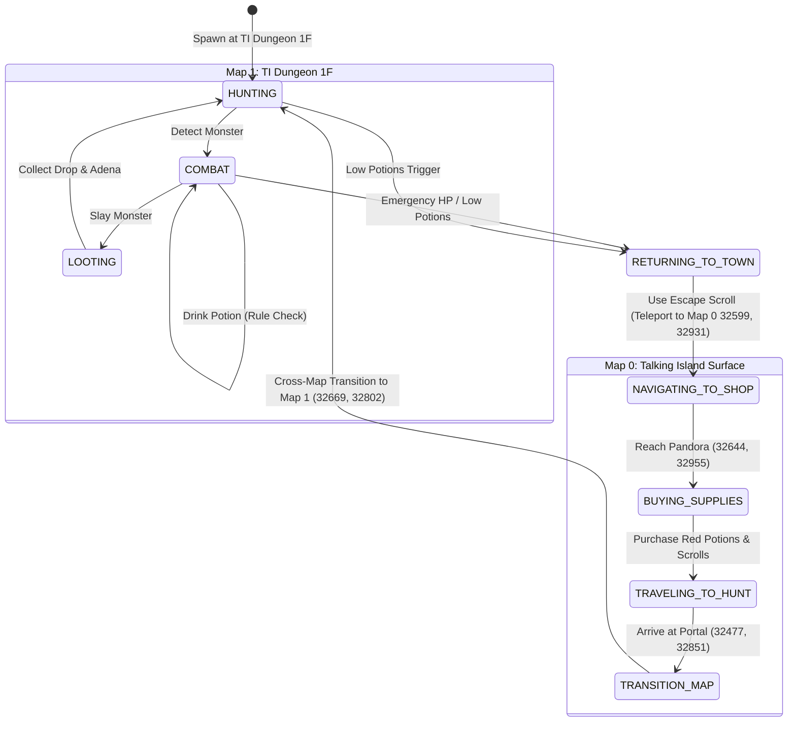

# Scenario 008: Configurable Autonomous Hunting & Town Resupply Cycle

## 1. Overview & Objective

Scenario 008 extends the L1J 1.82 Native Runtime from isolated in-dungeon combat into a complete, player-configurable, long-running closed-loop autonomous gameplay cycle.

In previous scenarios (Scenarios 001–007), the bot operated under hardcoded or semi-hardcoded hunting policies within dungeon map boundaries (Map 1). Scenario 008 achieves:

1. **Player-Configurable Autonomous Policy**: Behavior is entirely driven by user configuration files (`AutonomousConfig` / JSON), decoupling user intentions from legacy gameplay mechanics.
2. **Autonomous Closed Loop**:
   - Continuous hunting on Talking Island Dungeon 1F (Map 1).
   - Dynamic HP management via configured potion thresholds and cooldown timers.
   - Resource monitoring (low potion, low HP, weight/inventory).
   - Autonomous emergency escape / town return using canonical Escape Scrolls (item 139) to Talking Island Town (Map 0, `32599, 32931`).
   - Cross-town navigation to Pandora's general store (Map 0, `32644, 32955`).
   - NPC interaction, buying required consumables (Red Potions, Escape Scrolls) deducting Adena.
   - Surface cross-map navigation to Talking Island Dungeon entrance (Map 0, `32477, 32851`).
   - Bi-directional map portal transition (Map 0 $\leftrightarrow$ Map 1).
   - Resuming autonomous dungeon hunting, repeating indefinitely.
3. **Long-Running Virtual Time Simulation**: Verified for 30 minutes (1,800,000 ms) in virtual deterministic time without real-world latency or memory leaks.

---

## 2. Canonical Evidence & Legacy Provenance

Every step in Scenario 008 is verified against `Eujenz/182c` server database records:

| Mechanism | Legacy Source | Canonical Value |
| :--- | :--- | :--- |
| **Town Respawn / Restart** | `db/lineage/getback_restart.sql:223` | Talking Island Town: `(32599, 32931, map 0)` |
| **Town Return Item** | `db/lineage/etcitem.sql:139` | Escape Scroll (縮小的傳送卷軸), weight 1200 |
| **Escape Item Effect** | `src/l1j/server/server/model/item/etc/ScrollEscape.java` | Teleports caster to map's town return point |
| **Pandora Shop Catalog** | `db/lineage/npc_shop.sql:3` | Pandora (NPC 3): Red Potion (102, 37a), Orange Potion (103, 150a), Escape Scroll (139, 120a) |
| **Pandora Location** | `db/lineage/spawnlist_npc.sql:3` | Talking Island Surface: `(32644, 32955, map 0)` |
| **Dungeon Portal (Surface $\to$ 1F)** | `db/lineage/dungeon.sql:2` | Map 0 `(32477, 32851)` $\to$ Map 1 `(32669, 32802)` |
| **Dungeon Portal (1F $\to$ Surface)** | `db/lineage/dungeon.sql:97` | Map 1 `(32669, 32802)` $\to$ Map 0 `(32477, 32853)` |
| **Monster Adena Drops** | `db/lineage/droplist.sql` | Werewolf, Stone Golem, Zombie, Floating Eye drop Adena (item 40308) |

---

## 3. Closed-Loop Execution Lifecycle



---

## 4. Verification Results

### 30-Minute Virtual Simulation (1,800,000 ms)

Executed via `scenario_008_configurable_autonomous_hunting.py`:

```text
=================================================================
   SCENARIO 008 - CONFIGURABLE AUTONOMOUS HUNTING & RESUPPLY
=================================================================
[CONFIG LOADED] Loaded policy profile from: configs/autonomous_default.json
  Potion Rules:    2
  Emergency Rules: 1
  Return Method:   USE_ESCAPE_ITEM
  Resupply Items:  3
  Destination:     ti_dungeon_1f (Map 1)

>>> PHASE 1: INITIALIZE WORLD & HEADLESS PLAYER AGENT
[PASS] HeadlessBot spawned at Map 1 (32671, 32804) with HP: 100/100

>>> PHASE 2: RUN PERSISTENT AUTONOMOUS CYCLE (1800000 ms / 30.0 mins)
[SIMULATION COMPLETED] Elapsed Real Time: 17.02s (105.8x real-time)
  Virtual Time:       1800000 ms
  Termination Reason: SIMULATION_TIME_REACHED
  Monster Kills:      14
  Potions Consumed:   45
  Emergency Returns:  5
  Town Visits:        6
  Shop Purchases:     2
  Resupply Cycles:    2
  Adena Earned:       235
  Adena Spent:        1110
  Maps Traversed:     6
  Hunt Cycles:        3

>>> PHASE 3: SCENARIO 008 CONFORMANCE & VERIFICATION
[PASS] Virtual duration requirement met: 1800000 >= 1800000 ms.
[PASS] Monster combat executed: 14 monsters slain.
[PASS] Potion rules actively executed: 45 potions consumed.
[PASS] Town return cycle executed: 6 town visits.
[PASS] Town resupply cycle certified: 2 full cycle(s) with 2 purchases (1110 adena spent).
[PASS] Bi-directional cross-map travel verified: 6 map transitions, 3 hunting re-entries.
[PASS] Execution trace saved to: scenario_008_trace.jsonl

=================================================================
           SCENARIO 008 OVERALL STATUS: PASS                     
=================================================================
```

---

## 5. Certification Criteria

Scenario 008 is certified under the following conditions:
1. Virtual time simulated duration $\ge 1,800,000$ ms (or configurable duration).
2. Autonomous policy engine loaded from JSON and drives all high-level decisions.
3. $\ge 1$ complete town resupply cycle successfully performed (bot reaches town, buys supplies at Pandora, navigates to dungeon, traverses portal, and resumes hunting).
4. Zero synthetic shortcuts: pathfinding uses real Map 0 and Map 1 line-of-sight and collision grids via A*; shop prices and items follow `npc_shop.sql`.
5. 100% deterministic replayability with fixed seed.
