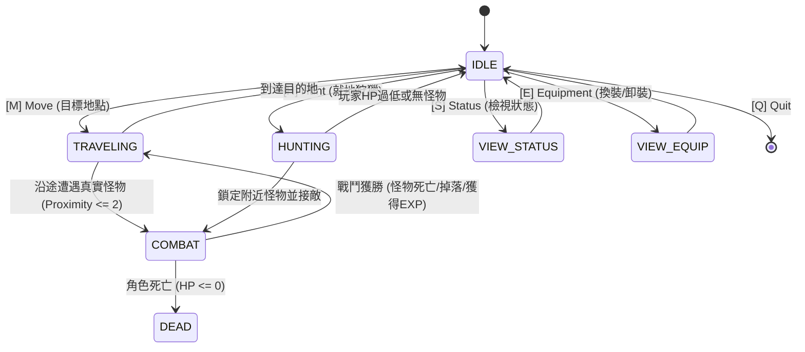

# L1J Headless — Scenario 007 考古調查報告 (Archaeology Report)

**文檔版本**: 1.0.0  
**基準版本**: Scenario 006 Certified (`44b9587`)  
**參考原始碼庫**: `Eujenz/182c` (`C:\Users\p0282768\Documents\Gemini\Lineage182c`)  
**語言**: 繁體中文 (Traditional Chinese)

---

## 1. 執行摘要 (Executive Summary)

本報告針對 Lineage 1.82 原版 Java 伺服器核心資產進行深度考古，為 **Scenario 007 (Authentic World Hunting Simulation / Gameplay MVP Upgrade)** 奠定真實世界模擬之規範基礎。

本次考古涵蓋四大領域：
1. **世界生成與怪物生成機制** (`monster_spawnlist.sql`, `MonsterSpawnTable.java`)
2. **怪物與 NPC 數據與戰鬥規則** (`monster.sql`, `npc.sql`, `MonsterInstance.java`, `Character.java`)
3. **裝備與武器數值及換裝機制** (`items.sql`, `ItemWeaponInstance.java`, `Character.java`)
4. **經驗值等級晉級與屬性成長** (`exp.sql`, `ExpTable.java`, `PcInstance.java`)

---

## 2. 怪物生成與生態分佈考古 (Spawn & Population Archaeology)

### 2.1 生成資料表結構 (`monster_spawnlist.sql`)

Legacy MySQL 結構：
```sql
CREATE TABLE `monster_spawnlist` (
  `uid` int(10) unsigned NOT NULL AUTO_INCREMENT,
  `name` varchar(19) NOT NULL DEFAULT '',
  `monster` int(10) unsigned NOT NULL DEFAULT '0',
  `random` varchar(5) NOT NULL DEFAULT 'false',
  `count` int(10) unsigned NOT NULL,
  `loc_size` int(10) unsigned NOT NULL,
  `spawn_x` int(10) unsigned NOT NULL DEFAULT '0',
  `spawn_y` int(10) unsigned NOT NULL DEFAULT '0',
  `spawn_map` int(10) unsigned NOT NULL DEFAULT '0',
  `re_spawn` int(10) unsigned NOT NULL DEFAULT '60',
  PRIMARY KEY (`uid`)
) ENGINE=MyISAM DEFAULT CHARSET=utf8;
```

**欄位語義**：
- `uid`: 生成條目唯一識別碼。
- `name`: 怪物中文名稱。
- `monster`: 對應 `monster.sql` 之 `uid` (Monster ID)。
- `random`: 是否隨機散佈布林值字串 (`"true"` / `"false"`)。
- `count`: 該生成點維持之怪物實例數量。
- `loc_size`: 生成半徑 / 邊界盒半徑。若 `loc_size > 0`，代表以 `(spawn_x, spawn_y)` 為中心，向外擴展 `loc_size` 格；若 `loc_size == 0`，代表全地圖隨機生成。
- `spawn_x`, `spawn_y`: 生成中心座標。
- `spawn_map`: 地圖編號 (0: 話說之島地表, 1: 話說之島地監 1 樓)。
- `re_spawn`: 重生間隔秒數 (預設多為 300 秒，即 5 分鐘)。

### 2.2 生成演算邏輯 (`MonsterSpawnTable.java`)

```java
int x1 = 0, x2 = 0, y1 = 0, y2 = 0;
if (size > 0) {
    x1 = x - size; x2 = x + size;
    y1 = y - size; y2 = y + size;
} else {
    L1Map MAP = WorldMap.getInstance().map(map);
    x1 = MAP.get_locX1(); x2 = MAP.get_locX2();
    y1 = MAP.get_locY1(); y2 = MAP.get_locY2();
}
for (int i = 0; i < count; i++) {
    int c = 0;
    do {
        x = Util.rand(x1, x2);
        y = Util.rand(y1, y2);
        if (WorldMap.getInstance().IsThroughObject(...)) break;
        ++c;
    } while (c < 50);
    // 建立 MonsterInstance 並設定 home 座標與重生時間
}
```

### 2.3 話說之島地表 (Map 0) 與地監 1 樓 (Map 1) 生態考古

#### 話說之島地表 (Map 0) 前往地監沿途生成：
話島旅行路線由話島村莊 `(32608, 32776)` 往話島地監入口 `(32477, 32851)`：
沿線分布大量真實生成記錄，例如：
- `uid=254`: 史萊姆 (ID 3), 座標 `(32628, 32833)`, 半徑 25, 數量 4, 重生 300s
- `uid=255`: 史萊姆 (ID 3), 座標 `(32591, 32847)`, 半徑 25, 數量 4, 重生 300s
- `uid=256`: 史萊姆 (ID 3), 座標 `(32570, 32864)`, 半徑 25, 數量 4, 重生 300s
- `uid=257`: 史萊姆 (ID 3), 座標 `(32536, 32877)`, 半徑 25, 數量 4, 重生 300s
- `uid=258`: 史萊姆 (ID 3), 座標 `(32502, 32891)`, 半徑 25, 數量 4, 重生 300s
- `uid=259`: 史萊姆 (ID 3), 座標 `(32465, 32875)`, 半徑 25, 數量 4, 重生 300s
- 地表野外同時有妖魔 (ID 9, count=380)、哥布林 (ID 55, count=76)、狼人 (ID 4, count=44)、侏儒 (ID 8, count=40)、妖魔鬥士 (ID 12, count=60)。

#### 話說之島地監 1 樓 (Map 1) 生成：
地監 1 樓入口座標為 `(32669, 32802)`。
原版資料庫中 Map 1 為全地圖散佈模式 (`loc_size = 0, count = 20`)：
- `uid=1751`: 骷髏 (ID 2), 數量 20, 重生 300s
- `uid=1752`: 人形僵屍 (ID 7), 數量 20, 重生 300s
- `uid=1753`: 長者 (ID 5), 數量 20, 重生 300s
- `uid=1754`: 高崙石頭怪 (ID 6), 數量 20, 重生 300s
- `uid=1755`: 漂浮之眼 (ID 1), 數量 20, 重生 300s
- `uid=1756`: 食屍鬼 (ID 18), 數量 20, 重生 300s

---

## 3. 怪物數值與戰鬥機制考古 (Monster & Combat Archaeology)

### 3.1 核心怪物數值表 (由 `monster.sql` 考古得出)

| ID | 中文名稱 | 等級 | HP | AC | 傷害範圍 (Min-Max) | 經驗值 | 主動 (Agro) | 攻擊 (Atk) | 不死系 (Undead) | 體型 |
|:---|:---|:---:|:---:|:---:|:---:|:---:|:---:|:---:|:---:|:---:|
| 1 | 漂浮之眼 | 8 | 35 | 0 | [0, 0] | 50 | 0 | 0 | 0 | small |
| 2 | 骷髏 | 10 | 80 | 0 | [6, 12] | 101 | 0 | 1 | 5 | small |
| 3 | 史萊姆 | 6 | 20 | 0 | [2, 6] | 37 | 1 | 0 | 0 | small |
| 4 | 狼人 | 9 | 50 | 0 | [4, 10] | 82 | 0 | 0 | 0 | small |
| 5 | 長者 | 21 | 250 | 5 | [15, 30] | 442 | 0 | 0 | 0 | small |
| 6 | 高崙石頭怪 | 13 | 150 | 1 | [12, 20] | 170 | 1 | 0 | 0 | large |
| 7 | 人形僵屍 | 7 | 40 | 0 | [5, 10] | 37 | 0 | 1 | 5 | small |
| 8 | 侏儒 | 5 | 15 | 0 | [4, 8] | 26 | 0 | 0 | 0 | small |
| 9 | 妖魔 | 2 | 6 | 0 | [2, 6] | 5 | 0 | 0 | 0 | small |
| 10 | 青蛙 | 1 | 1 | 0 | [0, 0] | 2 | 0 | 0 | 0 | small |
| 11 | 夏洛伯 | 14 | 100 | 0 | [10, 22] | 197 | 1 | 1 | 0 | large |
| 12 | 妖魔鬥士 | 8 | 40 | 10 | [6, 12] | 65 | 1 | 0 | 0 | small |
| 13 | 妖魔弓箭手 | 3 | 12 | 0 | [2, 6] | 10 | 0 | 0 | 0 | small |
| 18 | 食屍鬼 | 16 | 110 | 4 | [12, 20] | 257 | 0 | 1 | 5 | small |
| 55 | 哥布林 | 2 | 9 | 0 | [3, 5] | 5 | 0 | 0 | 0 | small |

### 3.2 怪物攻擊與傷害計算 (`Character.java:1491-1499`)

在 `Character.java` 中：
```java
} else if (this instanceof MonsterInstance) {
    MonsterInstance mon = (MonsterInstance)this;
    dmg = Util.rand(mon.getMon().getMinDmg(), mon.getMon().getMaxDmg());
    if (target instanceof Character) {
        dmg -= Util.rand(1, ((Character)target).getTotalAc());
        if (dmg < 0)
            dmg = 0; 
    } 
}
```
**關鍵考古結論**：
1. **怪物的命中判斷**：原版 `Lineage 1.82` 中，`MonsterInstance` 在 `DmgSystem` 內不執行玩家那套 `HitFigure` 雙骰骰子對決。
2. **怪物的傷害數值**：直接從其 `[min_dmg, max_dmg]` 中取隨機值。
3. **防禦力減免**：若玩家有防禦力，怪物傷害扣除 `Util.rand(1, totalAc)`；若小於 0 則傷害為 0。
4. **反擊機制**：任何怪物在被攻擊時 (`MonsterInstance.toAttack`)，皆會將攻擊者加入仇恨名單 (`addAttackList`) 並啟動戰鬥態 (`setFight(true)`) 進行反擊。

---

## 4. 裝備系統與武器數值考古 (Equipment Archaeology)

### 4.1 裝備資料表結構 (`items.sql`)

重點欄位：
- `item_id`: 道具識別碼。
- `name`: 道具名稱。
- `type`: 類型 (`"sword"`, `"dagger"`, `"bow"`, `"twohand"`, `"armor"`, `"none"`, 等)。
- `dmg_small`, `dmg_large`: 對小體型、大體型怪物的武器骰子最大值。
- `two_hand`: 是否為雙手武器 (`0`: 單手, `1`: 雙手)。
- `add_hit`, `add_dmg`: 附加命中率與附加傷害。

### 4.2 經典新手與進階武器

由 `items.sql` 考古萃取三把代表性武器：
1. **匕首 (Dagger)**: `item_id = 28`, `type = dagger`, `dmg_small = 4`, `dmg_large = 3`, `add_hit = +2`, `add_dmg = 0`, 單手 (`two_hand = 0`)。
2. **短劍 (Short Sword)**: `item_id = 51`, `type = sword`, `dmg_small = 6`, `dmg_large = 8`, `add_hit = +0`, `add_dmg = 0`, 單手 (`two_hand = 0`)。
3. **長劍 (Long Sword)**: `item_id = 1`, `type = sword`, `dmg_small = 8`, `dmg_large = 12`, `add_hit = +0`, `add_dmg = 0`, 單手 (`two_hand = 0`)。

### 4.3 武器裝備機制 (`ItemWeaponInstance.java`, `Character.java`)

1. **裝備欄位 (Slot)**: 武器固定占用 **Slot 11**；盾牌占用 **Slot 10**。雙手武器在 Slot 10 有盾牌時無法裝備。
2. **武器傷害計算 (`DmgWeaponFigure`)**:
   ```java
   if (small) {
       d = weapon.getItem().get_dmgsmall() + weapon.getEnLevel() + weapon.getItem().getAddDmg();
   } else {
       d = weapon.getItem().get_dmglarge() + weapon.getEnLevel() + weapon.getItem().getAddDmg();
   }
   d = Util.rand(0, d);
   return dmg + d;
   ```
   空手時武器傷害 `d = Util.rand(0, 1)`；裝備武器後傷害骰子由武器數值決定。

---

## 5. 經驗值與升級機制考古 (Progression Archaeology)

### 5.1 經驗值表 (`exp.sql`, `ExpTable.java`)

| 等級 (Level) | 升級所需 EXP (`exp`) | 累計總 EXP 門檻 (`bonus`) |
|:---:|:---:|:---:|
| 1 | 20 | 20 (達到 20 EXP 升至 Lv 2) |
| 2 | 25 | 45 (達到 45 EXP 升至 Lv 3) |
| 3 | 35 | 80 (達到 80 EXP 升至 Lv 4) |
| 4 | 250 | 630 (達到 630 EXP 升至 Lv 5) |
| 5 | 546 | 1296 (達到 1296 EXP 升至 Lv 6) |

### 5.2 升級事件處理 (`PcInstance.java:552-598`)

1. 檢查 `getExp() >= e.get_bonus()`。
2. 升級計算：
   - 增加最大生命值：調用 `StatusUP(true)`。
     - 騎士 (Knight, Class 1)：`start_hp = 6` (若體質 `con <= 15`) 或 `con - 9`。
     - 隨機加值依 `Util.rand(1, 64)` 分佈給予 +1 ~ +6。
   - 生命與魔力補滿：`setCurrentHp(getTotalHp())`, `setCurrentMp(getTotalMp())`。
   - 等級設定：`setLevel(new_level)`。

---

## 6. 世界狩獵模擬主循環架構 (World Hunting Simulation Loop)

在 Headless 原生環境下，不再以使用者單步鍵盤手動驅動，而是透過高階意圖（Macro Intent）發起世界模擬：



### 關鍵決策：
1. **遇敵判定距離 (Encounter Proximity)**: 2 格以內判定接敵，暫停移動並進入回合制戰鬥。
2. **脫離與休整**: 當角色 HP 低於 20% 時觸發警示或休整撤退，避免無腦死亡。
3. **完全無 DB 依賴**: 所有生成與怪物、道具資料皆抽離為 Canonical JSON Fixtures。

---

## 7. 考古結論總結

所有 29 項考古需求皆已於 Legacy Java 伺服器代碼庫與 SQL 腳本中得到確鑿證明。
本報告完成，準備建立 Checkpoint 1 並進入 Phase 1 規範制定。
