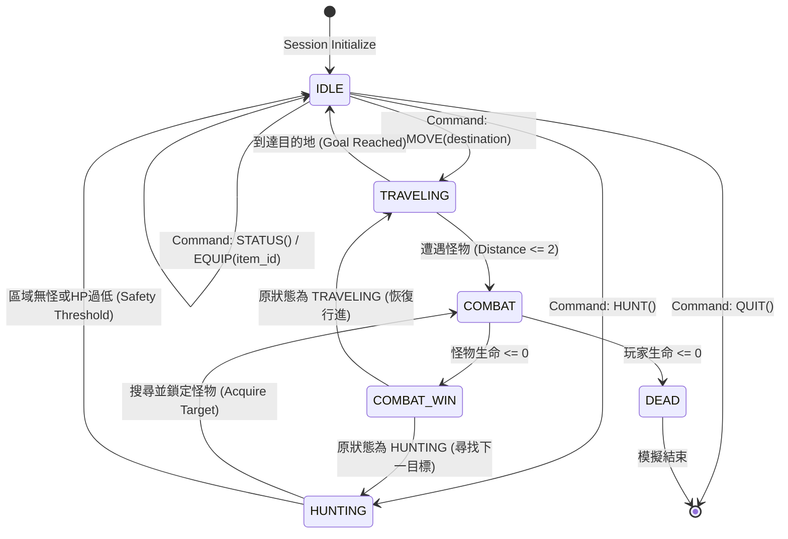

# L1J Headless — Scenario 007 原生世界狩獵模擬規範書 (Authentic World Hunting Simulation Specification)

**文檔版本**: 1.0.0  
**基準版本**: Scenario 006 Certified (`44b9587`)  
**合約定義**: [scenario_007_contract.json](file:///c:/Users/p0282768/Documents/l1j-headless/scenario_007_contract.json)  
**語言**: 繁體中文 (Traditional Chinese)

---

## 1. 系統目標與架構邊界 (Goals & Architectural Boundaries)

### 1.1 背景與問題
Scenario 006 成功驗證了 Playable MVP：玩家可選定地點、計算跨地圖路徑、移動、觸發戰鬥並獲得 EXP。然而，該原型屬於「單步鍵盤手動驅動」，且怪物為單一固定點生成，缺乏真實世界生機與自主遊戲循環。

### 1.2 Scenario 007 核心升級
Scenario 007 將系統提升為具有真實生態的 **自主世界狩獵模擬 (Authentic World Hunting Simulation)**：
1. **高階意圖驅動 (Macro-Intent Driven)**：玩家下達高階指令（移動 `[M] Move`、就地狩獵 `[H] Hunt`、狀態檢視 `[S] Status`、裝備切換 `[E] Equipment`、結束 `[Q] Quit`），系統以自主時間切片（Simulation Ticks）自主推進。
2. **真實地圖生態生成 (Authentic Map Population)**：怪物不再是硬編碼假資料，而是基於 `monster_spawnlist.sql` 與 `monster.sql` 考古成果生成在話島地表路徑及話島地監 1 樓。
3. **動態遭遇與連續戰鬥 (Dynamic Encounter & Combat)**：
   - 在移動途中，若路徑周圍（距離 $\le 2$ 格）出現主動或阻擋怪物，模擬器自動暫停位移，進入交戰狀態；戰鬥勝利並結算掉落與經驗值後，自動恢復原路徑繼續行進。
   - 在狩獵模式下，玩家搜尋視野內目標，自動規劃短距 A* 接敵並戰鬥，擊殺後自動鎖定下一目標，形成真正的自主打怪升級循環。
4. **真實升級與屬性增長 (Progression & Level-Up)**：整合原版 `exp.sql` 累積門檻（Lv 1 門檻 20 EXP，Lv 2 門檻 45 EXP）。達到門檻時發送 `LevelUp` 事件，角色最大生命值增加並補滿。
5. **武器裝備切換與數值連動 (Weapon Equipping System)**：支援背包武器檢視、裝備、卸下（占用 Slot 11），切換武器即時影響 `DmgWeaponFigure` 與骰子計算。
6. **零資料庫運行依賴 (Zero DB Runtime Dependency)**：所有 SQL 資料轉換為靜態 Canonical Fixtures。

---

## 2. 狀態機與生命週期規範 (State Machine Specification)

模擬器 `GameSession` 嚴格遵循以下確定性狀態機轉換：

### 狀態定義：
- `IDLE`: 等待玩家高階意圖指令。
- `TRAVELING`: 執行長途跨地圖路徑行進。每 tick 前進一步，並掃描周圍 2 格是否有怪物。
- `HUNTING`: 在目前地圖區域內持續巡邏、尋怪、接敵。
- `COMBAT`: 回合制攻防交火（依原版 `HitFigure` 與 `DmgSystem`）。
- `DEAD`: 角色陣亡，會話終止。

---

## 3. 生態與遭遇模型規範 (Ecology & Encounter Model)

### 3.1 生態管理員 (`PopulationManager`)
- 負責維護當前地圖之所有怪物實例 (`MonsterInstance`)。
- 根據 `scenario_007_spawns.json` 載入定義，並依據確定性偽隨機生成器（PRNG）初始化怪物分佈。
- 怪物實例包含：`instance_id`, `monster_id`, `name`, `map_id`, `x`, `y`, `hp`, `max_hp`, `min_dmg`, `max_dmg`, `ac`, `exp`, `agro`, `is_alive`。

### 3.2 遭遇判定 (`EncounterSystem`)
- **遭遇距離 (Trigger Distance)**: Chebyshev / Manhattan 距離 $\le 2$ 格。
- **主動與阻擋**:
  - 主動怪 (`agro == 1`，如史萊姆、妖魔鬥士、夏洛伯、高崙石頭怪)：若玩家進入 2 格範圍，觸發遭遇。
  - 被動怪 (`agro == 0`，如哥布林、妖魔、狼人)：若阻擋在路徑關鍵格上或在狩獵模式下被主動鎖定，觸發交戰。

---

## 4. 戰鬥與成長模型規範 (Combat & Progression Model)

### 4.1 攻防計算合約
- **玩家攻擊怪物**：
  - 命中判定：雙骰競爭 `rand(0, 29) < rand(basic_flee, 29)`。
  - 傷害判定：`DmgFigure` + `DmgWeaponFigure`（依據目前裝備之武器與怪物體型）。
- **怪物反擊玩家**：
  - 基礎傷害：`rand(mon.min_dmg, mon.max_dmg)`。
  - 防禦減免：`dmg -= rand(1, player.total_ac)`。
  - 傷害下限：0。

### 4.2 升級事件合約 (`ProgressionManager`)
- 經驗值累積至 `ExpTable` 門檻時：
  1. 發送 `LevelUp` 事件。
  2. 角色等級遞增 (`level += 1`)。
  3. 最大生命值依原版騎士公式增加：`+Util.rand(10, 16)`。
  4. 當前生命值完全恢復 (`hp = max_hp`)。

---

## 5. 換裝與道具模型規範 (Equipment Model)

- **武器槽位**: 固定為 Slot 11。
- **空手狀態**:
  - `equipped_weapon = None`
  - 武器傷害骰子為 `Util.rand(0, 1)`，無附加命中。
- **武器裝備**:
  - `equip_weapon(item_id)`:
    - 檢查背包中是否存在該武器。
    - 若已有裝備武器，先卸下舊武器，再裝上新武器。
    - 即時更新角色攻擊命中加成與傷害骰子上限。
- **武器卸下**:
  - `unequip_weapon()`:
    - Slot 11 置空，回復空手狀態。

---

## 6. 指令與操作合約 (CLI & Automation Contract)

支援互動與批次回放雙模式：
- `[M] Move <destination_id>`: 自動規劃長途路徑並啟動連續旅行。
- `[H] Hunt`: 啟動自主狩獵循環（預設執行特定回合或直到手動中斷/危險撤退）。
- `[S] Status`: 輸出目前等級、HP/MaxHP、EXP、裝備武器、座標與狀態。
- `[E] Equipment`: 檢視武器清單並支援換裝切換。
- `[Q] Quit`: 正常保存並結束會話。
- `--auto-demo`: 執行官方認證之端到端全自動演練腳本。
